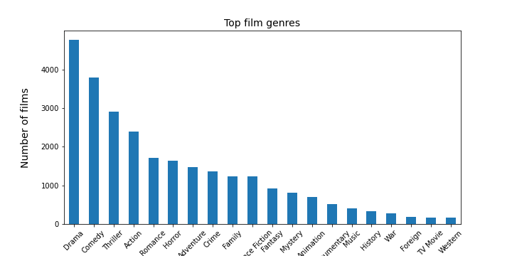

# Data Analysis: The Movie Database

In the report (`project-investigate-a-dataset.ipynb`), we analyze a dataset obtained from The Movie Database (TMDB). The dataset contains information about 10,000 movies; this information includes numerical data such as budget, revenue, and user ratings, as well as non-numerical data such as director, cast, and genre.

We investigate the most popular directors, production companies, and genres. We also investigate which properties are associated with movies revenue.

# Findings

We analyzed the TMDB database for movies released between 1960 and 2015.  

The most prolific director is Woody Allen, and the production company that has produced the most movies is Paramount Pictures. The most common genre is "Drama", and the least common genre is "Western".  

  

For our numerical analysis, we removed those movies which had no recorded budget or revenue.  

On visual inspection, the following two variables appear to be positively correlated with increased revenue: Popularity & Budget (as expected).   

  

  

Both visual inspection and an R value close to zero indicate only a very weak correlation of the revenue with average vote (unexpected).   
